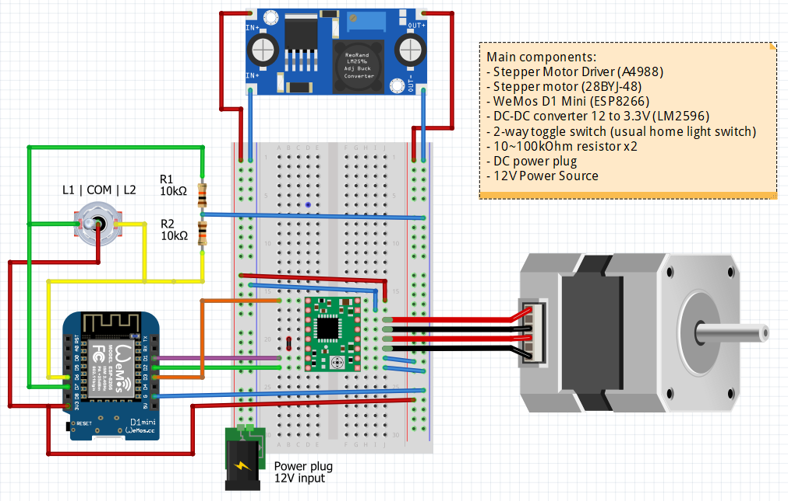

# Smart Blinds Controller

Motorized Smart Roller Blinds Controller with MQTT and WEB configuration portal. <br>
The project was created on 07.08.2019 in Arduino IDE and rebuild in PlatformIO 01.09.2021

<br>


[](https://platformio.org/)

[](https://www.espressif.com/en/products/socs/esp8266)

[](https://www.espressif.com/en/products/socs/esp32)

[](https://opensource.org/licenses/MIT)

<br>


<br>

## Wiring Schematic



<br>

## Getting Started 

- Upload latest release to your ESPx module.
- When your ESP starts up, it sets it up in Station mode and tries to connect to a previously saved Access Point.
- If this is unsuccessful (or no previous network saved) it moves the ESP into Access Point mode and spins up a DNS and WebServer. Reading buttons and stepper control are not enabled at that point.
- Using any WiFi-enabled device with a browser (computer, phone, tablet) connect to the newly created Access Point with default name **Smart-Blinds** and no password.
- Because of the Captive Portal and the DNS server you will either get a 'Join to network' type of popup or get any domain you try to access redirected to the configuration portal. If not, type *192.168.4.1* in your browser.
- Choose one of the access points scanned and enter the password.
- Set up your MQTT, OTA and stepper motor setting.
- Click *Save*.
- ESP now will try to connect. If successful, it relinquishes control back to your app. If not, please reset ESP and reconnect to AP to reconfigure the device.
- Build-in LED will flash 5 times when it will be ready.
- When the ESP has connected to WiFi and MQTT, you can start sending commands by MQTT.

<br>

Remember that you have only **180 seconds** by default to configure your ESP. After timeout, AP will be disabled and ESP will be able to read buttons and control the stepper.
If you want to change some settings after a successful connection, then you have two ways:
- Switch off your Access Point and reset ESP - when ESP starts up, it sets it up in Station mode.
- Erase all settings by pressing *Reset* button 3 times - build-in LED will start blinking many times and AP will be activated.

<br>

## MQTT:
 - MQTT and all other settings can be found in `lib/defs/def.h`
 - State report is provided every `PUBLISH_STEP_LONG` (default **30**) seconds in idle and `PUBLISH_STEP_SHORT` (default **0.5**) seconds when moving.
 - Default command topic to set blinds position (using **0~100%** values) is:
  `"/blinds/set_position"`
 - You can control blinds with *Open*, *Close* and *Stop* commands by using defult topic `"/blinds/set"` and payloads:
 ```c++
    MQTT_CMD_OPEN               "OPEN"
    MQTT_CMD_CLOSE              "CLOSE"
    MQTT_CMD_STOP               "STOP"
 ```
 - Default state report topic returns the value of actual blinds position from **0%** to **100%**
 ```c++
    MQTT_PUBLISH_TOPIC          "/blinds/position"
 ```


<br>

## Home Assistant YAML configuration
```yaml
cover:
  - platform: mqtt
    name: "Bedroom"
    device_class: shade
    command_topic: "/blinds/set"
    position_topic: "/blinds/position"
    availability:
      - topic: "/blinds/availability"
    set_position_topic: "/blinds/set_position"
    payload_open: "OPEN"
    payload_close: "CLOSE"
    payload_stop: "STOP"
    position_open: 100
    position_closed: 0
    optimistic: false
    position_template: "{{ value }}"
```

<br>

## Notes

If you want to rebuild this project in VS Code with PlatformIO, you need to manually download [WiFiManager library v2.0.4-beta](https://github.com/tzapu/WiFiManager) and put it in `lib/WiFiManager/`.

<br>

## Dependencies
WiFiManager library v2.0.4-beta https://github.com/tzapu/WiFiManager

Stepper Motor library v1.61 https://github.com/waspinator/AccelStepper

MQTT library v2.8 https://github.com/knolleary/pubsubclient

<br>

## Copyright

Copyright (c) 2021 Sen Morgan. Licensed under the MIT license, see LICENSE.md