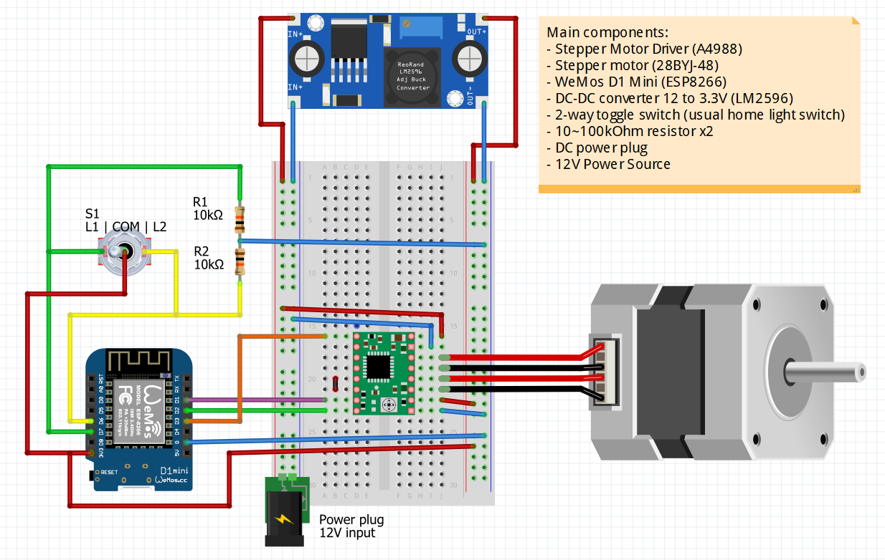

# Smart Blinds Controller

Motorized Smart Roller Blinds Controller with MQTT control and WEB configuration portal for WiFi connection. <br>
The project was created on 07.08.2019 in Arduino IDE and rebuild in PlatformIO 01.09.2021

<br>


[](https://platformio.org/)

[](https://www.espressif.com/en/products/socs/esp8266)

[](https://www.espressif.com/en/products/socs/esp32)

[](https://opensource.org/licenses/MIT)

<br>


<br>

## Wiring Schematic



<br>

## Getting Started 

- Open this project in [PlatformIO](https://platformio.org/)
- Change settings as you wish in ``/lib/defs/def.h``
- Also you need to create ``/lib/defs/secrets.h`` file and paste in there:

```cpp
#ifndef SECRETS_h
#define SECRETS_h

/* change these variables as your own */
#define MQTT_LOGIN     "your_login"
#define MQTT_PASSWORD  "your_password"
#define OTA_PASS       "your_OTA_password"
/* stop changing here */

#endif /* SECRETS_h */
```
- :warning:Don't forget to write your own credentials and setting in both files!:warning:
- Build this project and upload it to your ESPx module.
- After succeful flash please follow [this WiFiManager guide](https://github.com/tzapu/WiFiManager#how-it-works).
- When the ESP has connected to WiFi, you can start sending commands by MQTT

<br>

## MQTT:
 - State report is provided every ```PUBLISH_STEP_LONG``` (default **30**) seconds in idle and ```PUBLISH_STEP_SHORT``` (default **0.5**) seconds when moving.
 - Command topic to set blinds position (**0~100%**) is 
  ```yaml
    #define MQTT_SET_POSITION_TOPIC     "/blinds/set_positi
  ```
 - You can control blinds with *Open*, *Close* and *Stop* commands by using this topic and payloads:
 ```yaml
    #define MQTT_CMD_TOPIC              "/blinds/set"
    #define MQTT_CMD_OPEN               "OPEN"
    #define MQTT_CMD_CLOSE              "CLOSE"
    #define MQTT_CMD_STOP               "STOP"
 ```
 - State report topic returns the value of actual blinds position from **0%** to **100%**
 ```yaml
    #define MQTT_PUBLISH_TOPIC          "/blinds/position"
 ```


<br>

## Home Assistant YAML configuration
```yaml
cover:
  - platform: mqtt
    name: "Bedroom"
    device_class: shade
    command_topic: "/blinds/set"
    position_topic: "/blinds/position"
    availability:
      - topic: "/blinds/availability"
    set_position_topic: "/blinds/set_position"
    payload_open: "OPEN"
    payload_close: "CLOSE"
    payload_stop: "STOP"
    position_open: 100
    position_closed: 0
    optimistic: false
    position_template: "{{ value }}"
```

<br>

## Dependencies
WiFiManager library v2.0.4-beta https://github.com/tzapu/WiFiManager

Stepper Motor library v1.61 https://github.com/waspinator/AccelStepper

MQTT library v2.8 https://github.com/knolleary/pubsubclient

<br>

## Copyright

Copyright (c) 2021 Sen Morgan. Licensed under the MIT license, see LICENSE.md